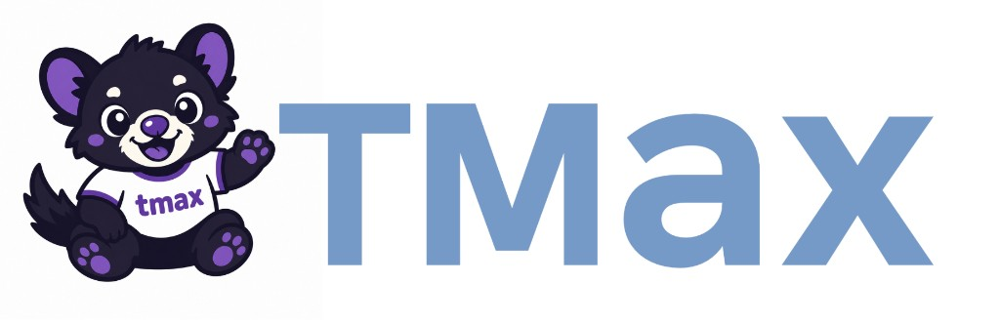

<p align="center">
  
</p>

<p align="center">
  <em>Data generation and evaluation for terminal-using agents.</em>
</p>

<p align="center">
  <a href="#whats-here">Overview</a> ·
  <a href="#repository-layout">Layout</a> ·
  <a href="#quickstart">Quickstart</a> ·
  <a href="#requirements">Requirements</a>
</p>

---

**TMax** is the research codebase behind our work on training language models to
act as capable terminal agents. It covers synthesising diverse,
difficulty-aware terminal tasks, rolling them out with LLM agents to produce
training data, and evaluating models on [Terminal-Bench](https://www.tbench.ai/)
and friends. Everything runs on top of [Harbor](https://github.com/laude-institute/harbor)
for sandboxed task execution and [LiteLLM](https://github.com/BerriAI/litellm)
for model access.

## What's here

| Component | What it does |
|-----------|--------------|
| **`rl_data/`** | A simple, scalable, diverse, difficulty-aware pipeline for synthesising terminal-agent tasks, solving them at pass@k, analysing the corpus, and publishing it to the Hugging Face Hub. Tasks are sampled as an *independent product of structured axes* and packaged as self-contained Apptainer/Docker environments with programmatic verifiers. |
| **`Vanillux2Agent/`** | The Harbor agent used for solving and evaluation: a direct LiteLLM agent built on the vanillux prompt harness (mini-SWE-agent-derived prompts, bash tool schema, submit marker, format-error recovery, and output truncation), executing commands through Harbor's active environment. |
| **`training/open-instruct/`** | A fork of [open-instruct](https://github.com/allenai/open-instruct) with fixes for Qwen 3.5 and terminal-agent training. SFT and DPPO RL launch scripts for the tmax models live under `training/open-instruct/scripts/tmax/`. |
| **`scripts/` + `beaker_configs/`** | Evaluation infrastructure — shell/Slurm launchers and a Beaker pipeline that serves a model with vLLM and runs Harbor datasets (Terminal-Bench, TB-Lite, SWE-bench) against it. |

## Repository layout

```
tmax/
├── rl_data/            # terminal task data generation pipeline (see rl_data/README.md)
│   ├── generate_tasks.py       # sample axes → template → tests → container build+smoke
│   ├── generate_solutions.py   # solve tasks with agents, collect pass@k
│   ├── analyze.py              # composition / difficulty / balance stats + plots
│   ├── generator/             # taxonomy, personas, fixtures, verifiers, solvers
│   ├── comparison/            # composition/difficulty vs external baselines
│   ├── decontamination/       # 13-gram overlap vs Terminal-Bench / TB-Lite
│   └── scripts/               # thin launchers for every stage
│
├── Vanillux2Agent/     # Harbor agent (direct LiteLLM, vanillux prompt harness)
│
├── training/           # open-instruct fork for SFT + RL (see training/open-instruct/README.md)
│   └── open-instruct/
│       └── scripts/tmax/   # SFT/ and RL/ launch scripts for the tmax models
│
├── beaker_configs/     # Beaker launchers (launch_eval.sh, launch_vllm.sh)
├── scripts/            # eval launchers (Terminal-Bench, TB-Lite, SWE-bench) + beaker pipeline
└── pyproject.toml      # deps, pinned via uv.lock
```

## Quickstart

Python is run via [`uv`](https://github.com/astral-sh/uv); all commands run from
the repo root.

```bash
# Install dependencies
uv sync
```

### Generate task data

```bash
# 1. generate a small task corpus
NUM_TASKS=10 OUT_DIR=rl_data/output/tasks_smoke \
    bash rl_data/scripts/generate_tasks/run_generate_tasks.sh

# 2. solve the tasks with an LLM agent at pass@k
TASKS_DIR=rl_data/output/tasks_smoke \
    bash rl_data/scripts/generate_solutions/run_generate_solutions.sh

# 3. analyse pass@k + composition/balance stats
TASKS_DIR=rl_data/output/tasks_smoke \
    bash rl_data/scripts/analyze/run_analyze.sh
```

See [`rl_data/README.md`](rl_data/README.md) for the full pipeline, corpus
kinds, and SFT warm-start details.

### Train a model

SFT and DPPO RL are run via the open-instruct fork in `training/open-instruct/`.
Launch scripts for the tmax models live under `scripts/tmax/` (`SFT/` and `RL/`):

```bash
# from training/open-instruct/, e.g. RL on Qwen3.5-4B
bash scripts/tmax/RL/qwen35_4b.sh <beaker-image>
```

See [`training/open-instruct/scripts/tmax/README.md`](training/open-instruct/scripts/tmax/README.md)
for how to read the scripts (`mason.py` launcher vs. the underlying training command)
and how to run them off-cluster.

### Evaluate a model

Run a Harbor dataset against a locally served model on Beaker:

```bash
./beaker_configs/launch_eval.sh allenai/open_instruct_dev \
    --revision sft_qwen3_4b_tmax_4node \
    --name sft-4b \
    --dataset terminal-bench@2.0
```

See [`scripts/beaker/README.md`](scripts/beaker/README.md) for the full eval
pipeline, flags, and troubleshooting.

## Requirements

- **[`uv`](https://github.com/astral-sh/uv)** for dependency management (deps pinned in `pyproject.toml` / `uv.lock`).
- An **LLM API key** for the configured model (e.g. `GEMINI_API_KEY`); local
  vLLM / Ollama / OpenAI-compatible endpoints are also supported via env vars.
- **`apptainer`** on PATH for building and running task containers.
- **`HF_TOKEN`** for the Hugging Face upload stage and for pulling gated models.

## Licensing

This codebase is licensed under Apache 2.0 as given in [LICENSE](LICENSE).
